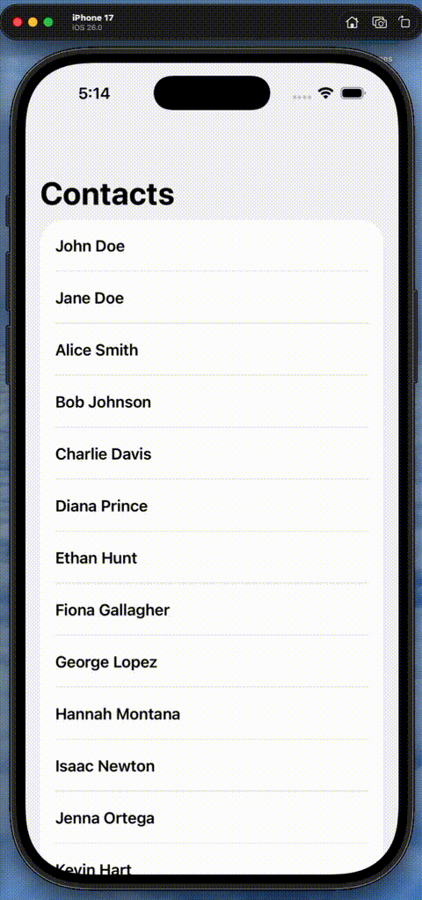

# Router for Navigation in SwiftUI Apps
Navigation in **SwiftUI** apps can be quite complex at times. Here's my take on making a router which can be used in your app for reliable navigation and data flow.

Shout out to James on Youtube for the idea! - [Navigation in SwiftUI is Difficult | Build a Router](https://youtu.be/GCZ9tFRlVGQ?feature=shared)

This router makes efficient use of SwiftUI's NavigationPath and Hashable protocol.

General idea is to conform your model to Hashable protocol to pass it down in the Navigation Path.

